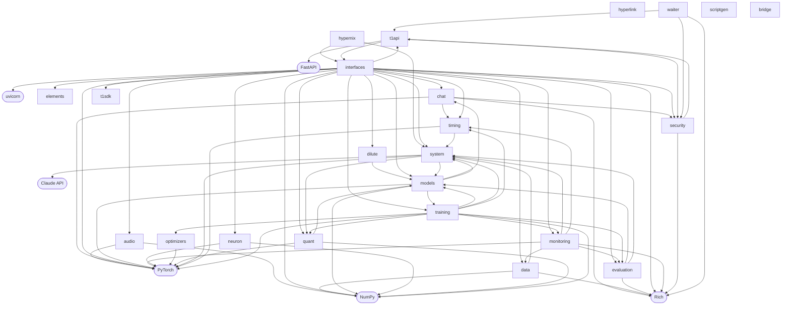
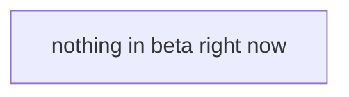

# Architecture

This page is generated. It is rebuilt by the `arch-map` workflow every
time a public release is published, and it updates **in place** — there
is one chart on this page and it is always the current one.

That is the whole point of generating it. A hand-drawn architecture
diagram is wrong within a month and nobody notices, because the only
person who would notice is somebody reading it to learn the system —
exactly the person least able to tell that it is out of date. This one
is read out of the source tree: imports become edges, packages become
nodes, and the beta surface is whatever is actually marked beta.

## How to read it

The first chart is the shipped system: the major dependencies, the
modules, and what talks to what. The second, smaller chart below it is
the surface that is not settled yet:

| Line | Means |
|---|---|
| **solid** | Shipped. In the main chart, working today. |
| **dotted** | Added in beta. Present in the tree, not yet promised. |
| **red** | Declared and not built yet. |

A module is beta when it says so — `__beta__ = True` at module level —
and an edge is planned when a module names it in `__planned__`. Nothing
here is maintained by hand, because a legend maintained by hand decays
exactly like the chart it explains.

Only the largest modules are drawn. The tail of any real package is
single-file utilities, and a chart with ninety nodes communicates less
than no chart at all.

<!-- ARCHMAP:START -->


### In beta, and not yet built

Solid is shipped and lives in the chart above. **Dotted** is a feature added in beta — present in the tree, not yet promised. **Red** is declared and not built yet.


<!-- ARCHMAP:END -->

## Regenerating it yourself

```bash
python -m hypernix.system.archmap --write wiki/Architecture.md
```

It rewrites only the block between the two markers; everything else on
this page is ordinary prose and is left alone.
