# HyperNix Release Timeline

This page contains an automatically updated timeline of all public releases.

## Release v0.70.6 (2026-07-15)

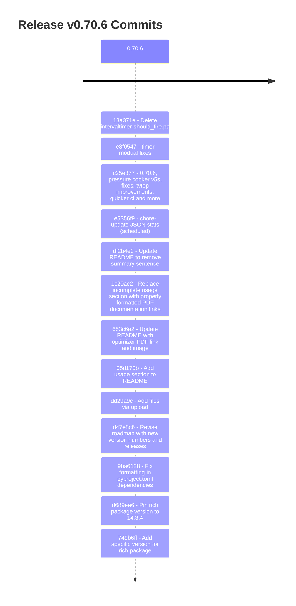
```mermaid
timeline
    title Release v0.70.6 Commits
    0.70.6
        : 13a371e - Delete fix-intervaltimer-should_fire.patch
        : e8f0547 - timer modual fixes
        : c25e377 - 0.70.6, pressure cooker v5s, fixes, tvtop improvements, quicker cl and more
        : e5356f9 - chore- update JSON stats (scheduled)
        : df2b4e0 - Update README to remove summary sentence
        : 1c20ac2 - Replace incomplete usage section with properly formatted PDF documentation links
        : 653c6a2 - Update README with optimizer PDF link and image
        : 05d170b - Add usage section to README
        : dd29a9c - Add files via upload
        : d47e8c6 - Revise roadmap with new version numbers and releases
        : 9ba6128 - Fix formatting in pyproject.toml dependencies
        : d689ee6 - Pin rich package version to 14.3.4
        : 749b6ff - Add specific version for rich package
```

## Release v0.70.6-2 (2026-07-19)

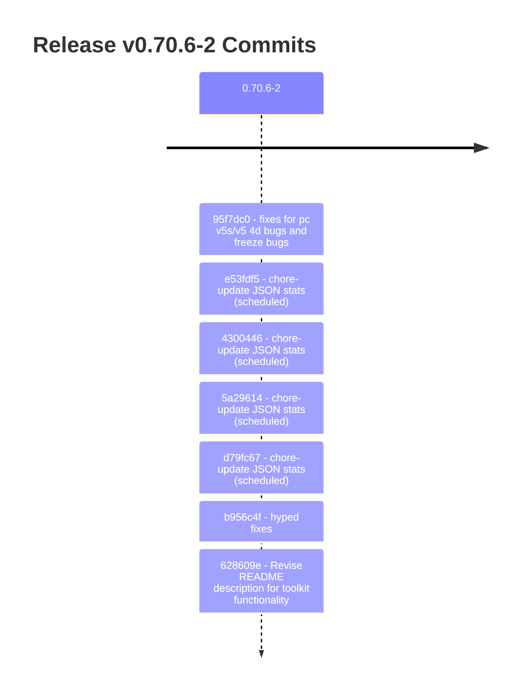
```mermaid
timeline
    title Release v0.70.6-2 Commits
    0.70.6-2
        : 95f7dc0 - fixes for pc v5s/v5  4d bugs and freeze bugs
        : e53fdf5 - chore- update JSON stats (scheduled)
        : 4300446 - chore- update JSON stats (scheduled)
        : 5a29614 - chore- update JSON stats (scheduled)
        : d79fc67 - chore- update JSON stats (scheduled)
        : b956c4f - hyped fixes
        : 628609e - Revise README description for toolkit functionality
```

## Release v0.70.6-3 (2026-07-20)

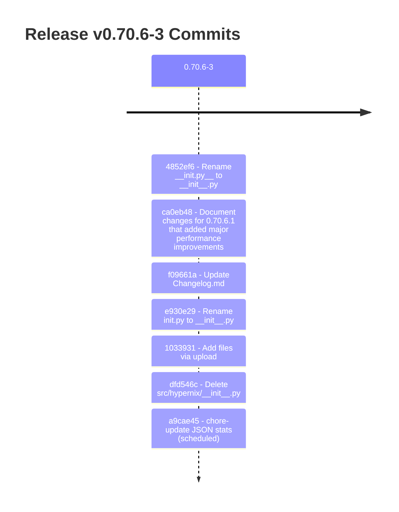
```mermaid
timeline
    title Release v0.70.6-3 Commits
    0.70.6-3
        : 4852ef6 - Rename __init.py__ to __init__.py
        : ca0eb48 - Document changes for 0.70.6.1 that added major performance improvements
        : f09661a - Update Changelog.md
        : e930e29 - Rename init.py to __init__.py
        : 1033931 - Add files via upload
        : dfd546c - Delete src/hypernix/__init__.py
        : a9cae45 - chore- update JSON stats (scheduled)
```

## Release v0.71.0 (2026-07-20)

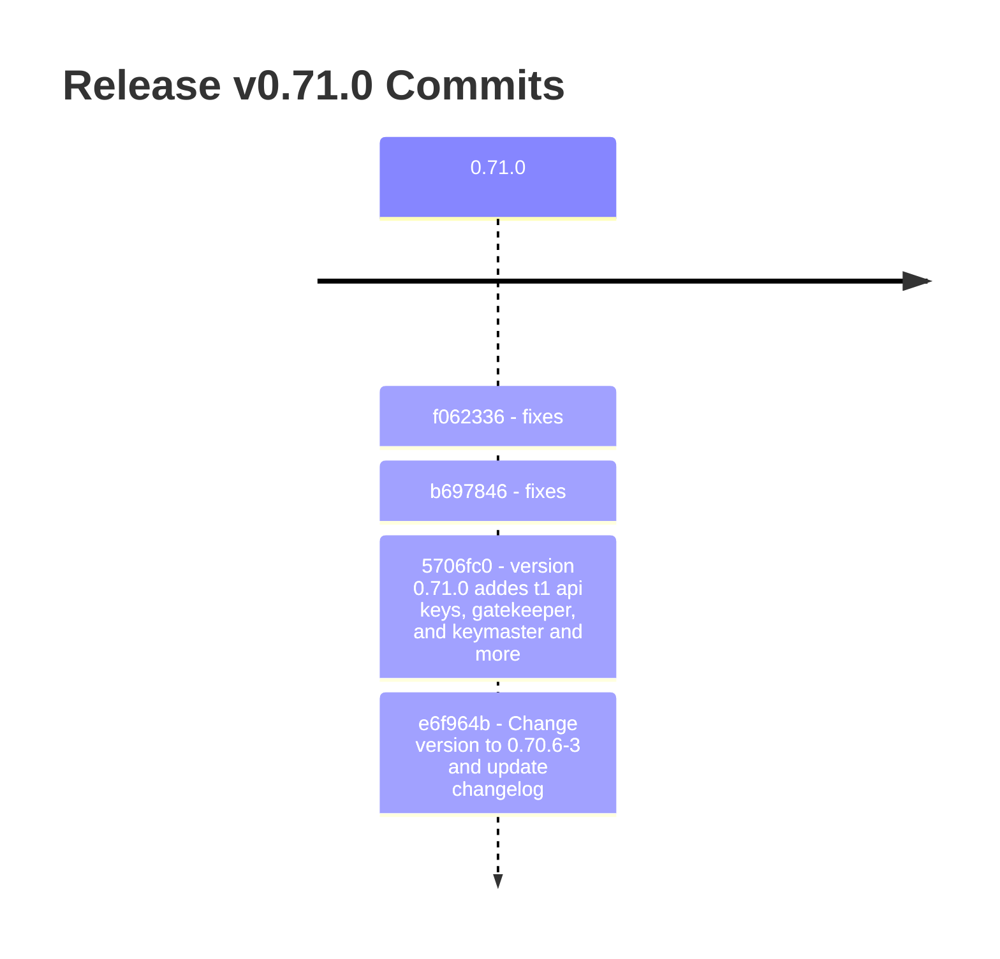
```mermaid
timeline
    title Release v0.71.0 Commits
    0.71.0
        : f062336 - fixes
        : b697846 - fixes
        : 5706fc0 - version 0.71.0 addes t1 api keys, gatekeeper, and keymaster and more
        : e6f964b - Change version to 0.70.6-3 and update changelog
```

## Release v0.71.1 (2026-07-21)

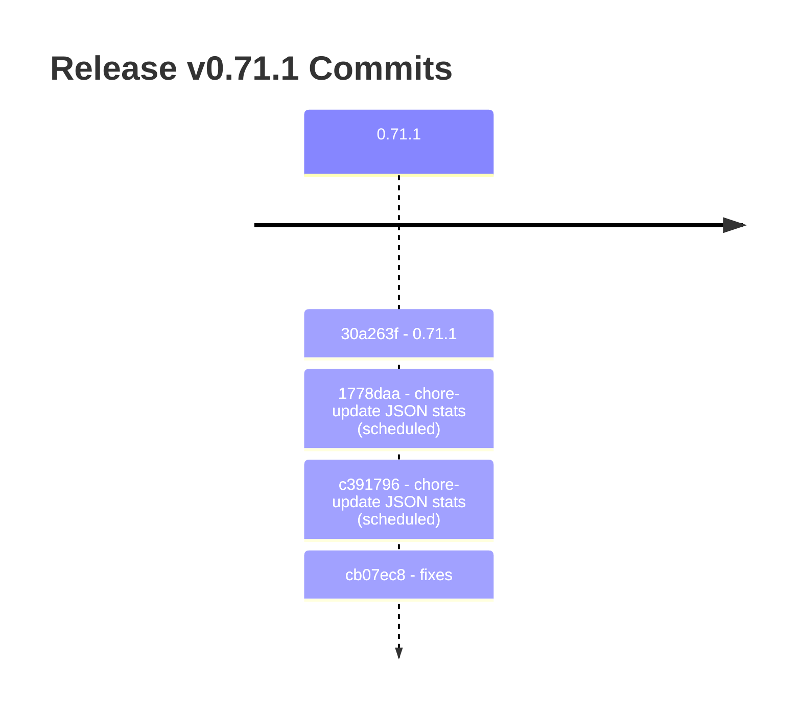
```mermaid
timeline
    title Release v0.71.1 Commits
    0.71.1
        : 30a263f - 0.71.1
        : 1778daa - chore- update JSON stats (scheduled)
        : c391796 - chore- update JSON stats (scheduled)
        : cb07ec8 - fixes
```

## Release v0.71.2 (2026-07-22)

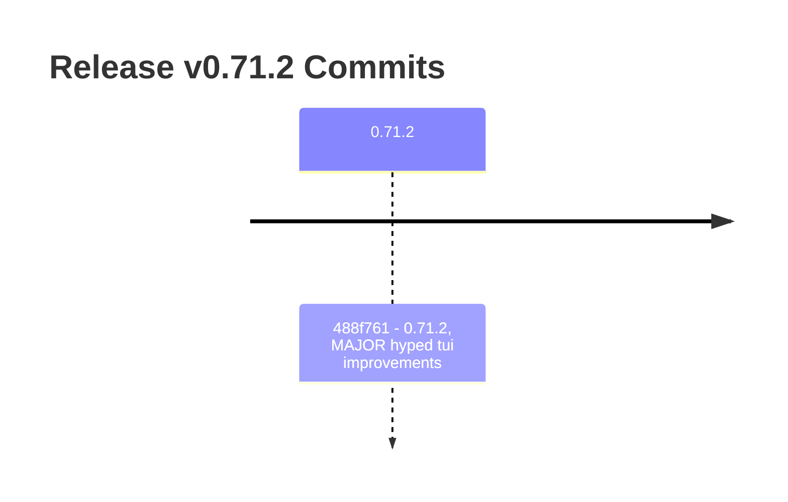
```mermaid
timeline
    title Release v0.71.2 Commits
    0.71.2
        : 488f761 - 0.71.2, MAJOR hyped tui improvements
```

## Release v0.71.3 (2026-07-22)

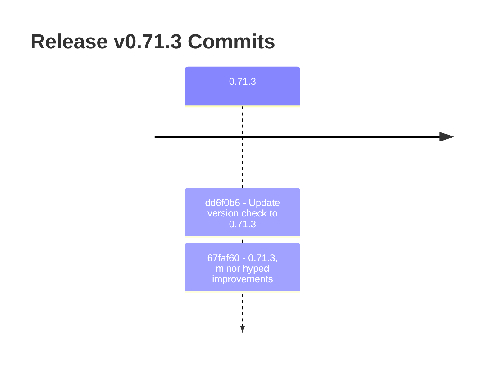
```mermaid
timeline
    title Release v0.71.3 Commits
    0.71.3
        : dd6f0b6 - Update version check to 0.71.3
        : 67faf60 - 0.71.3, minor hyped improvements
```

## Release v0.71.4b1 (2026-07-26)

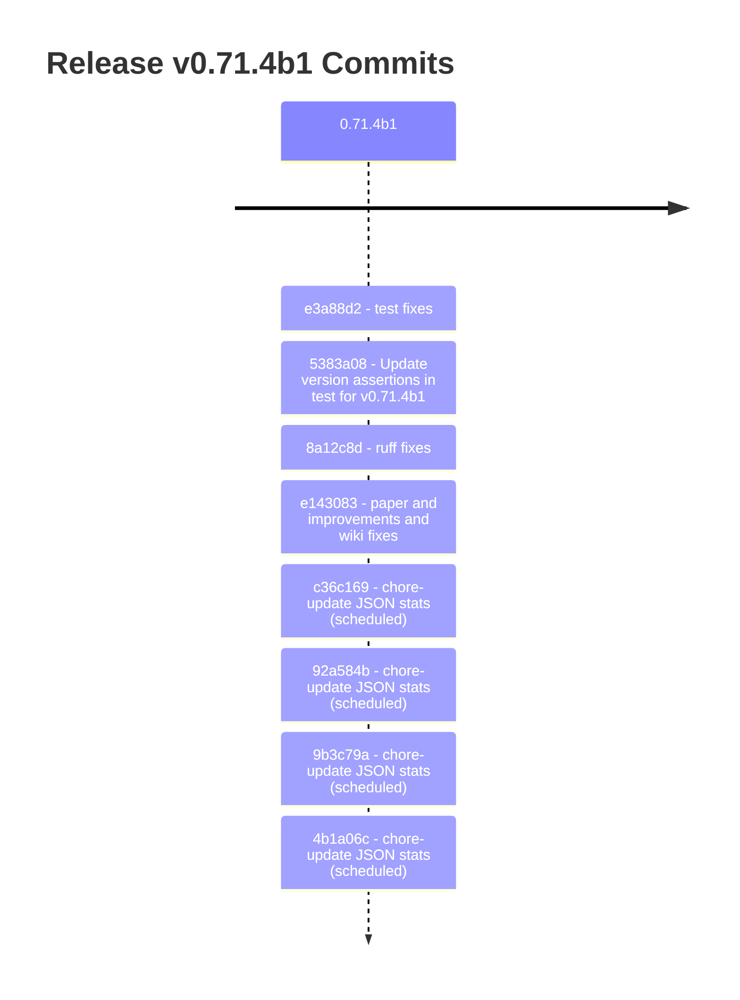
```mermaid
timeline
    title Release v0.71.4b1 Commits
    0.71.4b1
        : e3a88d2 - test fixes
        : 5383a08 - Update version assertions in test for v0.71.4b1
        : 8a12c8d - ruff fixes
        : e143083 - paper and improvements and wiki fixes
        : c36c169 - chore- update JSON stats (scheduled)
        : 92a584b - chore- update JSON stats (scheduled)
        : 9b3c79a - chore- update JSON stats (scheduled)
        : 4b1a06c - chore- update JSON stats (scheduled)
```

## Release v0.71.4b2 (2026-07-26)

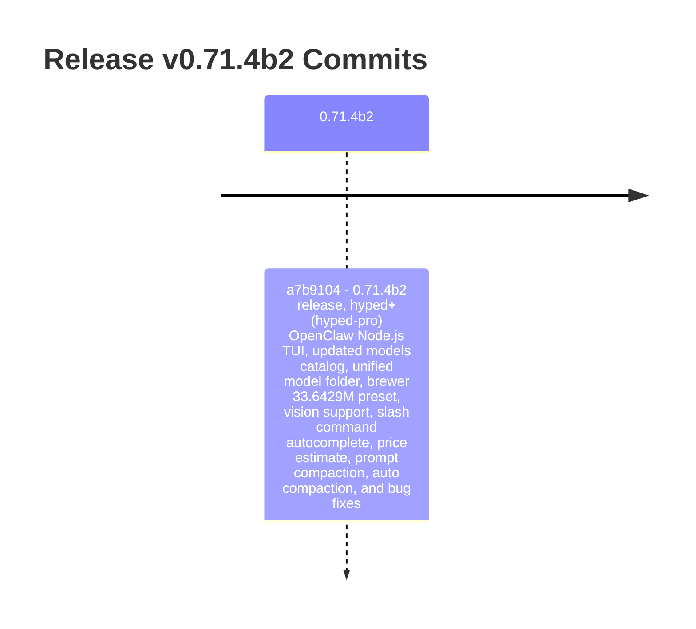
```mermaid
timeline
    title Release v0.71.4b2 Commits
    0.71.4b2
        : a7b9104 - 0.71.4b2 release, hyped+ (hyped-pro) OpenClaw Node.js TUI, updated models catalog, unified model folder, brewer 33.6429M preset, vision support, slash command autocomplete, price estimate, prompt compaction, auto compaction, and bug fixes
```

## Release v0.71.4b2 (2026-07-26)

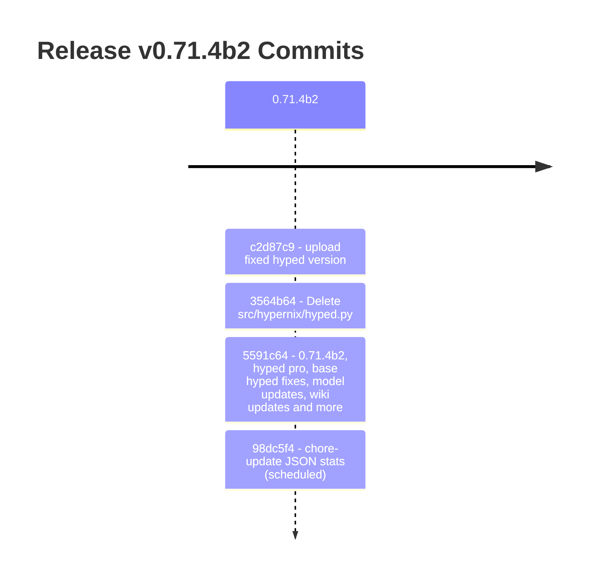
```mermaid
timeline
    title Release v0.71.4b2 Commits
    0.71.4b2
        : c2d87c9 - upload fixed hyped version
        : 3564b64 - Delete src/hypernix/hyped.py
        : 5591c64 - 0.71.4b2, hyped pro, base hyped fixes, model updates, wiki updates and more
        : 98dc5f4 - chore- update JSON stats (scheduled)
```

## Release v0.71.4b2 (2026-07-26)

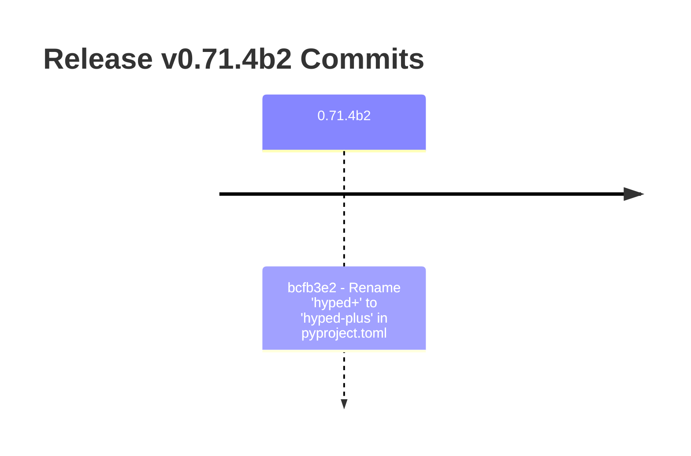
```mermaid
timeline
    title Release v0.71.4b2 Commits
    0.71.4b2
        : bcfb3e2 - Rename 'hyped+' to 'hyped-plus' in pyproject.toml
```

## Release v0.71.4b3 (2026-07-27)

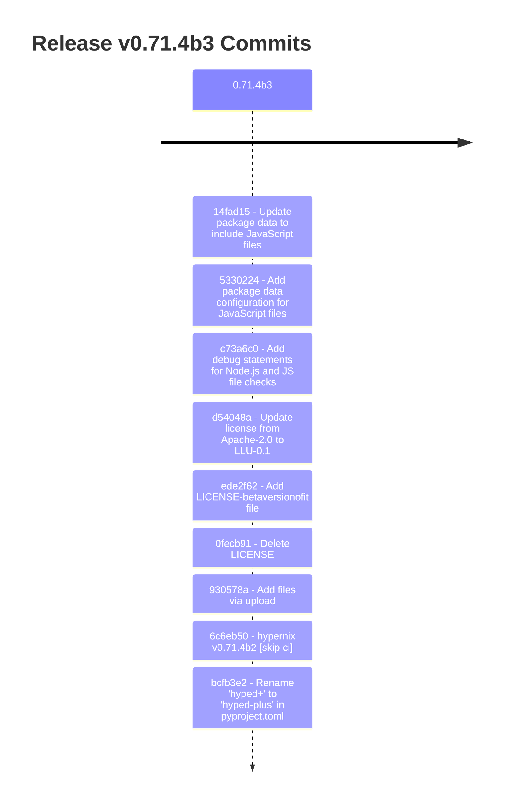
```mermaid
timeline
    title Release v0.71.4b3 Commits
    0.71.4b3
        : 14fad15 - Update package data to include JavaScript files
        : 5330224 - Add package data configuration for JavaScript files
        : c73a6c0 - Add debug statements for Node.js and JS file checks
        : d54048a - Update license from Apache-2.0 to LLU-0.1
        : ede2f62 - Add LICENSE-betaversionofit file
        : 0fecb91 - Delete LICENSE
        : 930578a - Add files via upload
        : 6c6eb50 - hypernix v0.71.4b2 [skip ci]
        : bcfb3e2 - Rename 'hyped+' to 'hyped-plus' in pyproject.toml
```

## Release v0.71.4b4 (2026-07-27)

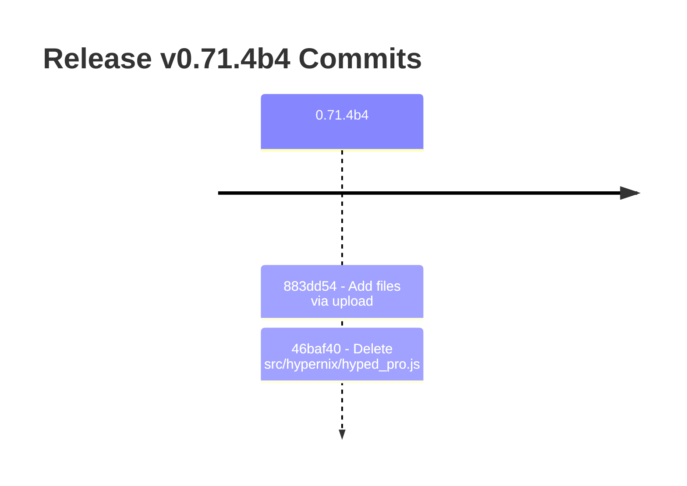
```mermaid
timeline
    title Release v0.71.4b4 Commits
    0.71.4b4
        : 883dd54 - Add files via upload
        : 46baf40 - Delete src/hypernix/hyped_pro.js
```

## Release v0.71.4b5 (2026-07-28)

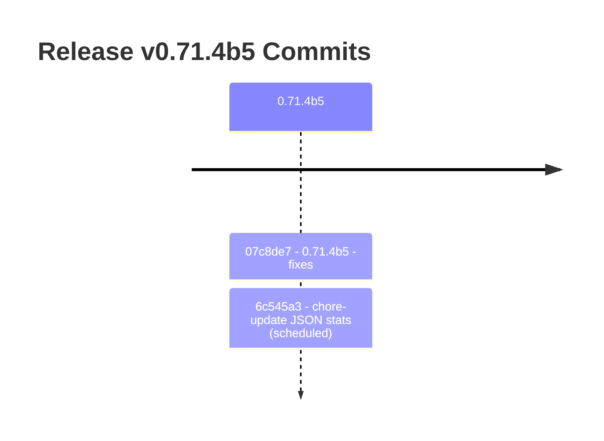
```mermaid
timeline
    title Release v0.71.4b5 Commits
    0.71.4b5
        : 07c8de7 - 0.71.4b5 - fixes
        : 6c545a3 - chore- update JSON stats (scheduled)
```

## Release v0.71.4rc1 (2026-08-05)

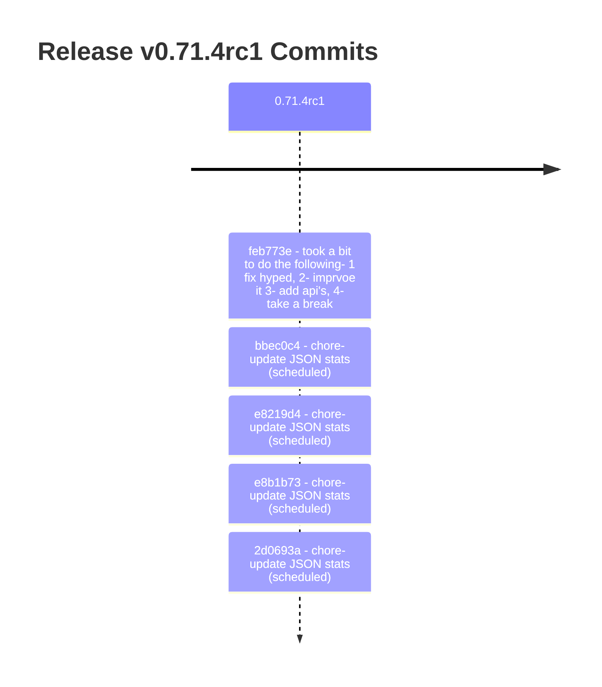
```mermaid
timeline
    title Release v0.71.4rc1 Commits
    0.71.4rc1
        : feb773e - took a bit to do the following- 1 fix hyped, 2- imprvoe it 3- add api's, 4- take a break
        : bbec0c4 - chore- update JSON stats (scheduled)
        : e8219d4 - chore- update JSON stats (scheduled)
        : e8b1b73 - chore- update JSON stats (scheduled)
        : 2d0693a - chore- update JSON stats (scheduled)
```

## Release v0.71.4 (2026-08-05)

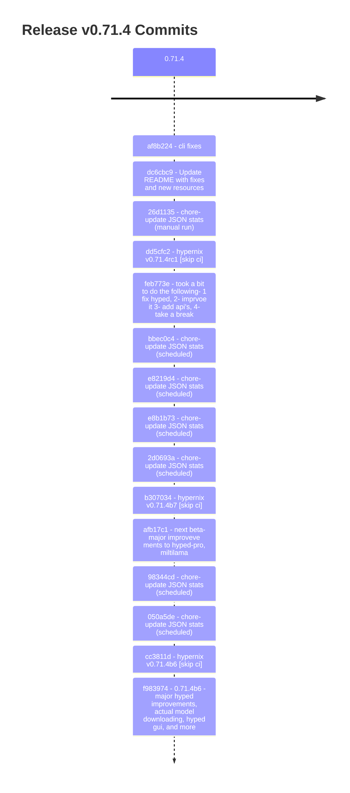
```mermaid
timeline
    title Release v0.71.4 Commits
    0.71.4
        : af8b224 - cli fixes
        : dc6cbc9 - Update README with fixes and new resources
        : 26d1135 - chore- update JSON stats (manual run)
        : dd5cfc2 - hypernix v0.71.4rc1 [skip ci]
        : feb773e - took a bit to do the following- 1 fix hyped, 2- imprvoe it 3- add api's, 4- take a break
        : bbec0c4 - chore- update JSON stats (scheduled)
        : e8219d4 - chore- update JSON stats (scheduled)
        : e8b1b73 - chore- update JSON stats (scheduled)
        : 2d0693a - chore- update JSON stats (scheduled)
        : b307034 - hypernix v0.71.4b7 [skip ci]
        : afb17c1 - next beta- major improveve ments to hyped-pro, miltilama
        : 98344cd - chore- update JSON stats (scheduled)
        : 050a5de - chore- update JSON stats (scheduled)
        : cc3811d - hypernix v0.71.4b6 [skip ci]
        : f983974 - 0.71.4b6 - major hyped improvements, actual model downloading, hyped gui, and more
```

## Release v0.71.4-1 (2026-08-06)

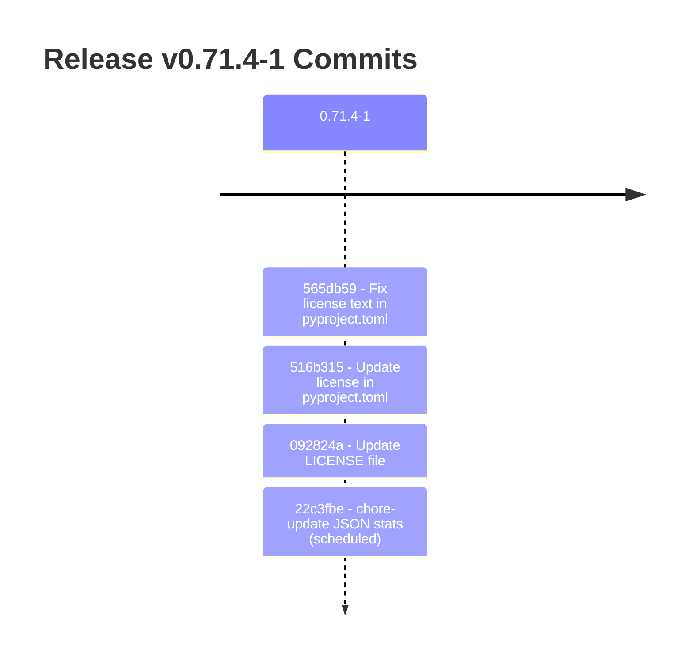
```mermaid
timeline
    title Release v0.71.4-1 Commits
    0.71.4-1
        : 565db59 - Fix license text in pyproject.toml
        : 516b315 - Update license in pyproject.toml
        : 092824a - Update LICENSE file
        : 22c3fbe - chore- update JSON stats (scheduled)
```

## Release v0.71.4-2 (2026-08-09)

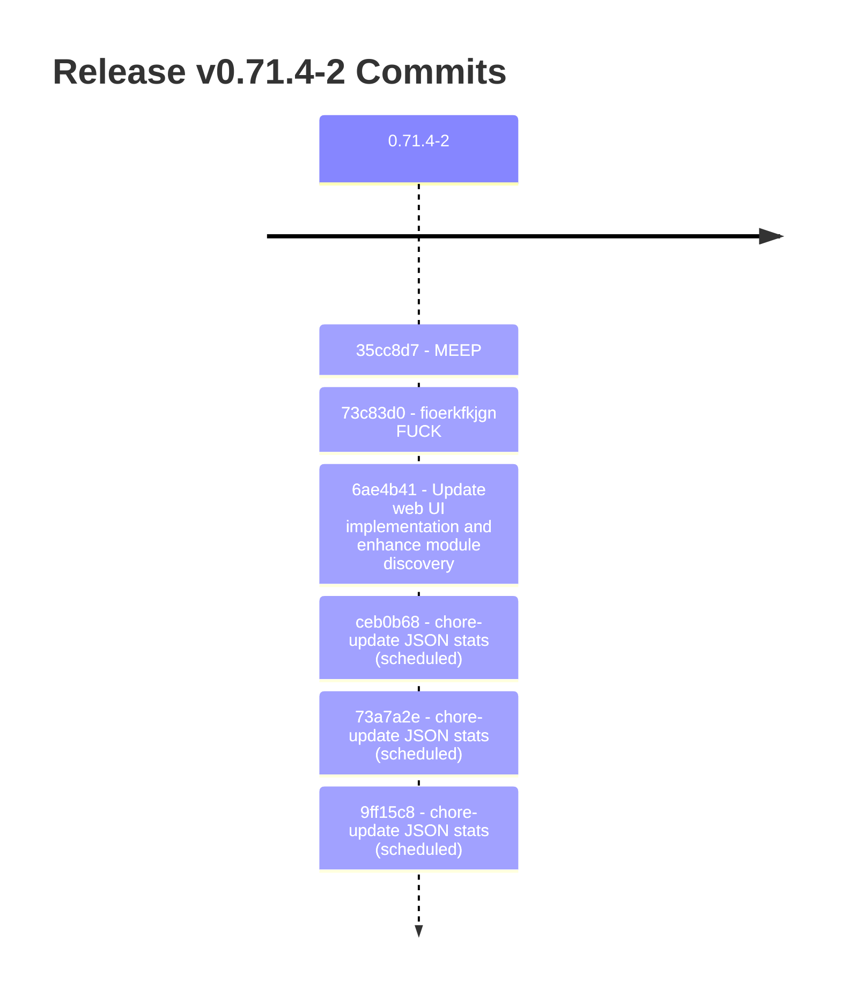
```mermaid
timeline
    title Release v0.71.4-2 Commits
    0.71.4-2
        : 35cc8d7 - MEEP
        : 73c83d0 - fioerkfkjgn FUCK
        : 6ae4b41 - Update web UI implementation and enhance module discovery
        : ceb0b68 - chore- update JSON stats (scheduled)
        : 73a7a2e - chore- update JSON stats (scheduled)
        : 9ff15c8 - chore- update JSON stats (scheduled)
```

## Release v0.71.4-3 (2026-08-09)

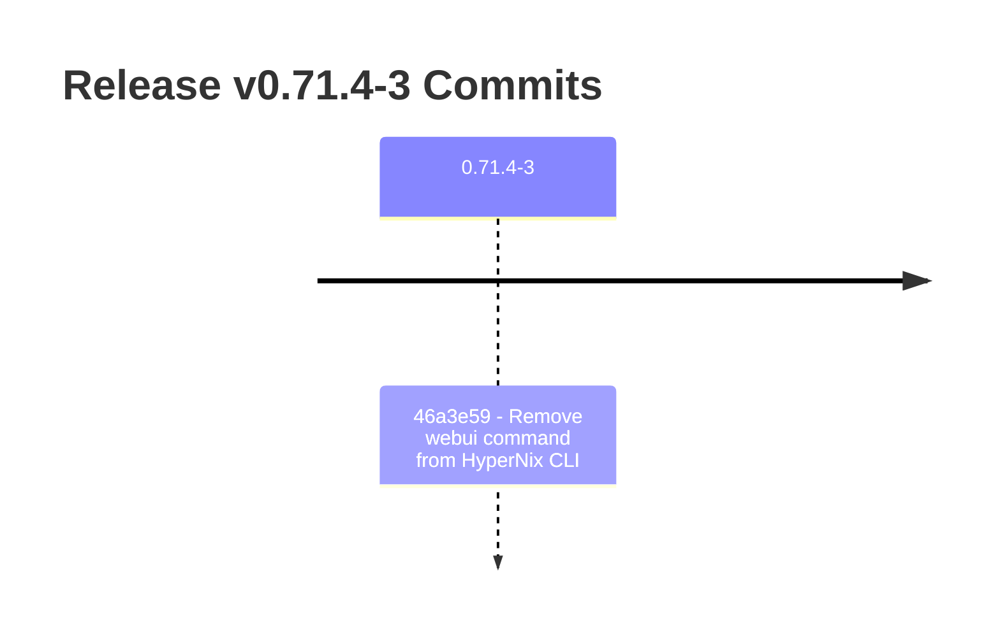
```mermaid
timeline
    title Release v0.71.4-3 Commits
    0.71.4-3
        : 46a3e59 - Remove webui command from HyperNix CLI
```

## Release v0.71.4-4 (2026-08-11)

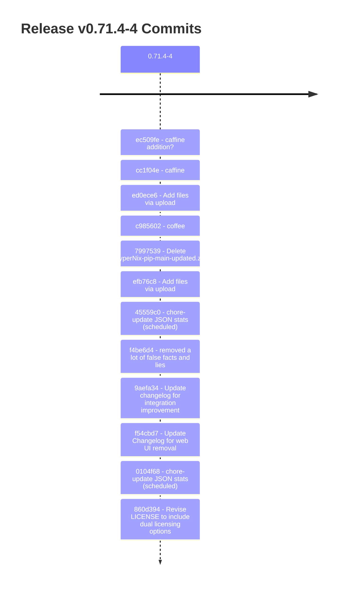
```mermaid
timeline
    title Release v0.71.4-4 Commits
    0.71.4-4
        : ec509fe - caffine addition?
        : cc1f04e - caffine
        : ed0ece6 - Add files via upload
        : c985602 - coffee
        : 7997539 - Delete HyperNix-pip-main-updated.zip
        : efb76c8 - Add files via upload
        : 45559c0 - chore- update JSON stats (scheduled)
        : f4be6d4 - removed a lot of false facts and lies
        : 9aefa34 - Update changelog for integration improvement
        : f54cbd7 - Update Changelog for web UI removal
        : 0104f68 - chore- update JSON stats (scheduled)
        : 860d394 - Revise LICENSE to include dual licensing options
```

## Release v0.71.4-5 (2026-08-16)

```mermaid
timeline
    title Release v0.71.4-5 Commits
    0.71.4-5
        : 626b562 - chore- update JSON stats (scheduled)
        : 5b91d75 - chore- update JSON stats (scheduled)
        : 9124d73 - chore- update JSON stats (scheduled)
        : a76b5b0 - Update Changelog with unfixed known bug note
        : 8a194f1 - Revise changelog for version 0.71.5
        : 623b9f8 - pc-v6+pc-v6v, other changes
        : f353068 - chore- update JSON stats (scheduled)
        : 338c2c3 - chore- update JSON stats (scheduled)
        : 63e58d3 - Revise Nix family section and model notes
        : b974f12 - Delete hypernix_fixes.diff
        : b0ebbce - Delete fix-hyped-dict-logits(1).patch
        : dc99f2d - Delete hypernix_pressure_cooker_v5_v5s.patch
        : 6ae442b - Delete ci-fixes-v8.patch
        : de808de - chore- update JSON stats (scheduled)
        : 883ffdd - chore- update JSON stats (manual run)
```

## Release v0.71.5a2 (2026-08-17)

```mermaid
timeline
    title Release v0.71.5a2 Commits
    0.71.5a2
        : 15aa12b - fixes
        : ee23dc0 - ruff fixes
        : 33d668c - 0.71.5a1 and a2
```

## Release v0.71.5postr1 (2026-08-21)

```mermaid
timeline
    title Release v0.71.5postr1 Commits
    0.71.5postr1
        : 49b678b - Adjust sleep durations in timer test cases
        : 293a22c - ci fixes
        : e9bcd09 - win fixes
        : 5b0268e - win fixes
        : 56c17b9 - Revise trademark section to unique naming
        : da87eda - Delete hypernix-ci-fixes.patch
        : bccc73e - fixes
        : 604ec86 - b2
        : 9017d71 - chore- update JSON stats (scheduled)
        : 5e3b3e6 - chore- update JSON stats (scheduled)
        : f836d29 - 0.71.5b1-part one of four for the api
        : 1438264 - chore- update JSON stats (scheduled)
        : 1d75aa0 - chore- update JSON stats (scheduled)
```

## Release v0.71.5b3 (2026-08-22)

```mermaid
timeline
    title Release v0.71.5b3 Commits
    0.71.5b3
        : 7a624da - 0.71.5b3- two bugs found by running against a real server
        : efa5fc8 - 0.71.5b3- deployment examples, documentation, and the security checklist
        : 47fd89e - 0.71.5b3- Beta 3 test suite, and four bugs it found
        : 7efe554 - Fix the CI failures on macOS and Windows
        : 572d4fa - Change logo image in README
        : 0b7c35c - Change license to HOL-1.0
        : b83cf1b - Update README for clarity and formatting fixes
        : 7e35f6e - Correct changelog link in README
        : f6cfe32 - Fix link to changelog in README
        : ada8451 - Update roadmap for version 0.72.0
        : 3e60ff8 - 0.71.5b3 (part 2/3)- complete SDK, full waiter TUI, smoke tool
        : 604a834 - 0.71.5b3 (part 1/3)- T1 API production hardening core
        : 8c1fb10 - chore- update JSON stats (scheduled)
        : d7c0961 - Add autofix-F for timer-test failures, and a router for all three
        : b24b3e4 - Make the assistant do real work instead of announcing it
```

## Release v0.71.5 (2026-08-22)

```mermaid
timeline
    title Release v0.71.5 Commits
    0.71.5
        : 5b82e76 - Fix the CI failures on Windows, macOS, and one ubuntu job
        : c1165b3 - hyped-pro- cancellation that cancels; neo_oven- streaming that decodes
        : 879b000 - 0.71.5rc2 — T1 API Beta 4, hyped-pro, and PATH setup
        : a846fc2 - Redesign the docs site without touching the palette
        : 0d3da96 - Make hnx map, eth, and ups actually work
        : ec50cbd - hypernix v0.71.5b3 [skip ci]
        : 7a624da - 0.71.5b3- two bugs found by running against a real server
        : efa5fc8 - 0.71.5b3- deployment examples, documentation, and the security checklist
        : 47fd89e - 0.71.5b3- Beta 3 test suite, and four bugs it found
        : 7efe554 - Fix the CI failures on macOS and Windows
        : 572d4fa - Change logo image in README
        : 0b7c35c - Change license to HOL-1.0
        : b83cf1b - Update README for clarity and formatting fixes
        : 7e35f6e - Correct changelog link in README
        : f6cfe32 - Fix link to changelog in README
```

## Release v0.72.0 (2026-08-23)

```mermaid
timeline
    title Release v0.72.0 Commits
    0.72.0
        : 7433970 - Regenerate egg-info for 0.72.0
        : fed3509 - iOS- a send race, a command that did not exist, and project hygiene
        : 797be9d - HyperLink for iOS, the waiter commands, and the release plumbing
        : c7eabfd - T1 v1.0.26.8.0.1- the LM Studio bridge and HyperLink
        : fa8ac81 - chore- update JSON stats (scheduled)
```

## Release v0.72.1 (2026-08-26)

```mermaid
timeline
    title Release v0.72.1 Commits
    0.72.1
        : 6e05bcf - docs- 0.72.1 changelog
        : 7f34566 - scriptgen, livestream, 6-bit momentum, and the 0.72.1 test suite
        : 4a74abc - noodle- multi-agent execution across nine providers
        : d91c43e - waiter -F- find a server, and never run what it tells you to
        : 4366727 - HyperLink- accept T2S keys, and download models from Hugging Face
        : 370119d - T1 v1.0.26.8.1.0- T2 recognition, auth undo/redo, and backups
        : c58beaa - T2 keys, the quantisation registry, steamroller, and Pascal tuning
        : ef51dc4 - chore- update JSON stats (scheduled)
        : 475dd51 - chore- update JSON stats (scheduled)
        : 7cb5daf - chore- update JSON stats (scheduled)
        : 3484723 - Remove next milestone details from Roadmap
        : 3fe8dbd - chore- update JSON stats (manual run)
```

## Release v0.72.2 (2026-08-26)

```mermaid
timeline
    title Release v0.72.2 Commits
    0.72.2
        : bb9332e - install-t1.sh- make --yes do what its help text promises
        : 56a9e0b - install-t1.sh- an interactive installer, and two bugs it exposed
```

## Release v0.72.2-2 (2026-08-27)

```mermaid
timeline
    title Release v0.72.2-2 Commits
    0.72.2-2
        : 70f2f6f - chore- update JSON stats (scheduled)
        : ba52f68 - 0.72.2-2- run_tailscale.sh suggested a command that does not work
```

## Release v0.72.2-3 (2026-08-27)

```mermaid
timeline
    title Release v0.72.2-3 Commits
    0.72.2-3
        : ed11d4b - Fix Host ID generation to exclude special characters that conflict with SSPKIDs and V1 Server IDs
        : 1f6c095 - 0.72.2-3- waiter explains a connection failure instead of restating it
        : 2218c14 - gkey- mint v2 and v2short keys, and report what this install can mint
```

## Release v0.72.2.post5 (2026-08-27)

```mermaid
timeline
    title Release v0.72.2.post5 Commits
    0.72.2.post5
        : a3fd981 - Ignore Python bytecode and tooling caches
        : 777797f - Do not import fastapi at collection time in the new test modules
        : eab3065 - T1 v1.0.2026.8.1.1- server IDs advance, and undo/redo actually works
        : c522250 - Keep setup.cfg's version in step with the other two
        : 8af94c4 - T2S keys- fix the refusal, and let the phone actually enter one
```

## Release v0.72.3 (2026-09-02)

```mermaid
timeline
    title Release v0.72.3 Commits
    0.72.3
        : 78582ae - Fix both CI failures- a version-dependent lint bar and a half-shadowed PATH
        : 56a179a - Fix two real test failures the missing-torch diagnosis was hiding
        : 3f872ce - chore- update JSON stats (scheduled)
        : 3245138 - 0.72.3- ship hypernix-t1, and make create work without a checkout
        : bcb0fa9 - Fix the CI failures- interpreter choice, a bash that is not one, backslashes in POSIX profiles
        : a7aeaff - VRAM optimizations- hypernix.system.vram
        : 1eb8121 - Import Callable from collections.abc, not typing
        : 4dbd9e2 - Docs modernization, billing-binding lifecycle, and 348 untracked .pyc
        : 4538dad - hypernix-t1- manage a T1 API server as a service, not an incantation
        : dc3de5b - Add Codacy security scan workflow
        : 4c25a42 - CI- gate the release on a live server, a real key and a fake model
        : 55378e1 - T2P billing keys, and a server's right to refuse them
        : e392ac0 - HyperLink- fix the three separate reasons it could not reach a server
        : 5d51695 - A new server issues itself a local, three-day admin key
        : a82c166 - Security- require consent before the AI agent runs code or touches credentials
```

## Release v0.72.3 (2026-09-02)

```mermaid
timeline
    title Release v0.72.3 Commits
    0.72.3
        : 2c584d3 - docs- 0.72.3 pt 3 changelog
        : 3c9b555 - gkey printed about one key in three thousand wrong
        : 67c4d08 - Dflash2- a draft model, inside the model it drafts for
        : e45cdfe - An imatrix maker, and an imatrix reader for anyone else's
        : ac30c2f - hyprslug writes the llama.cpp quants too, still with no llama.cpp
        : fc269ec - Ask bash where python3 is instead of telling it
        : 24012dc - Windows- a path is a path, not a URL scheme or a shell escape
        : 2569171 - wake-up- train a wake word, then listen for it
        : 260385e - hnx quantize without llama-cpp-python, and generate/chat that read GGUF
        : cf14b5b - The IQ0.x tiers now actually quantise, and need no llama.cpp
        : 931c893 - SSPKID that outlives its process, and gkey create -Con
        : 547dfa4 - T1 v1.0.2026.9.2.1- the governed inference surface
        : b3b97dd - CI- wait for every server, and let a release skip the integration gate
        : e1efc70 - Fix formatting of rich dependency in pyproject.toml
        : 0c67edd - Fix rich dependency version constraint
```

## Release v0.72.3.post1 (2026-09-03)

```mermaid
timeline
    title Release v0.72.3.post1 Commits
    0.72.3.post1
        : 1b575fe - Wire the sub-bit runtime all the way to the command line
        : 0437bba - Sub-bit in memory *and* fast enough to run
        : 74ff8f0 - chore- update JSON stats (scheduled)
        : 4c26095 - Sub-bit in memory too, not only on disk
        : 9f57892 - The sub-bit models can be run now
        : b191c39 - --json now means JSON on --list-tiers
        : a825a36 - hypernix v0.72.3 [skip ci]
        : 2c584d3 - docs- 0.72.3 pt 3 changelog
        : 3c9b555 - gkey printed about one key in three thousand wrong
        : 67c4d08 - Dflash2- a draft model, inside the model it drafts for
        : e45cdfe - An imatrix maker, and an imatrix reader for anyone else's
        : ac30c2f - hyprslug writes the llama.cpp quants too, still with no llama.cpp
        : fc269ec - Ask bash where python3 is instead of telling it
        : 24012dc - Windows- a path is a path, not a URL scheme or a shell escape
        : 2569171 - wake-up- train a wake word, then listen for it
```

## Release v0.72.3.post2 (2026-09-03)

```mermaid
timeline
    title Release v0.72.3.post2 Commits
    0.72.3.post2
        : 403fe0c - Compare interpreter paths by which one, not by which spelling
        : abc01a9 - 0.72.3.post4 — two bugs that were invisible on the machine that wrote them
        : 7a6e68d - Fix a heredoc that ran commands, and a test that only passed here
        : 9c49726 - Run the sub-bit runtime on CUDA, ROCm, Metal and Intel
        : 75693da - 0.72.3.post2 — hypernix-t1 fixes, example configs, wikis
        : 29962c9 - tvtoppro- tvtop++'s numbers, btop++'s presentation
        : afb85f8 - Five new quant types, and hyprslug-headers
        : ca23e01 - Update package-ecosystem in dependabot.yml
        : 0184183 - Update package-ecosystem in dependabot.yml
        : cbe800a - Add Dependabot configuration file
```

## Release v0.72.3.post7 (2026-09-03)

```mermaid
timeline
    title Release v0.72.3.post7 Commits
    0.72.3.post7
        : ac0053d - 0.72.3.post6 — hypernix-t1 index, and three more from the field
        : 67558a5 - chore- update JSON stats (scheduled)
        : 5037556 - 0.72.3.post5 — what running the shipped commands on a real box found
```

## Release v0.72.3.post8 (2026-09-04)

```mermaid
timeline
    title Release v0.72.3.post8 Commits
    0.72.3.post8
        : b57e28c - 0.72.3.post7 — 'it is installed already', and it was
```

